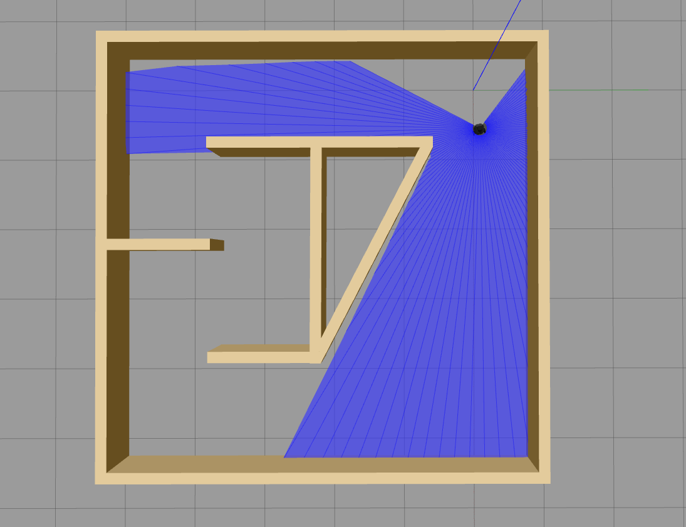
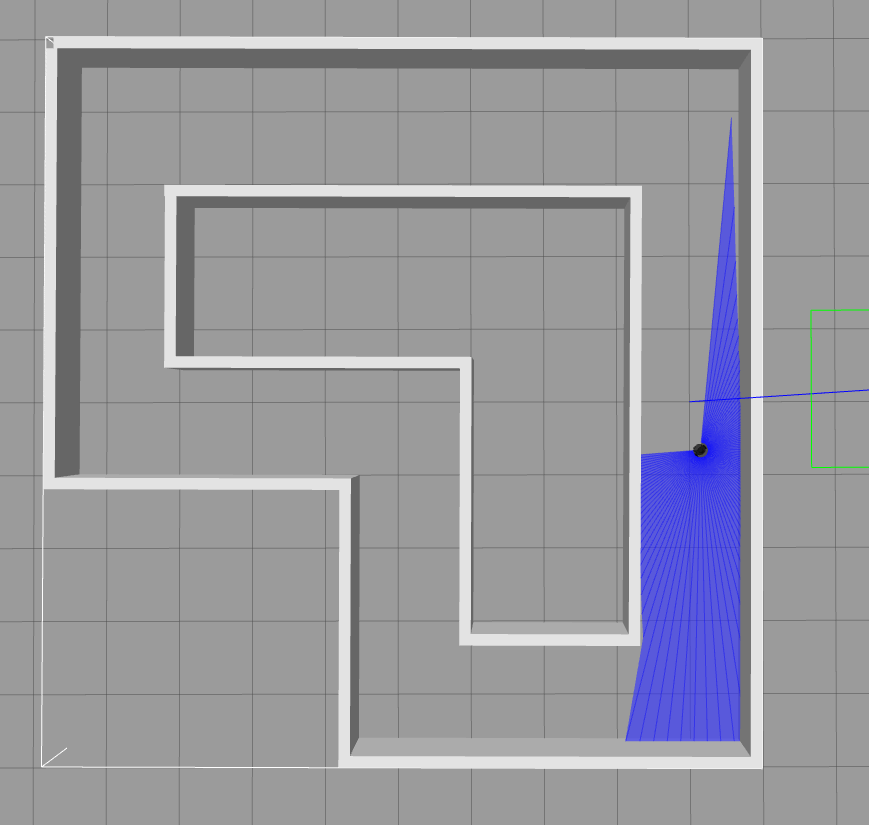
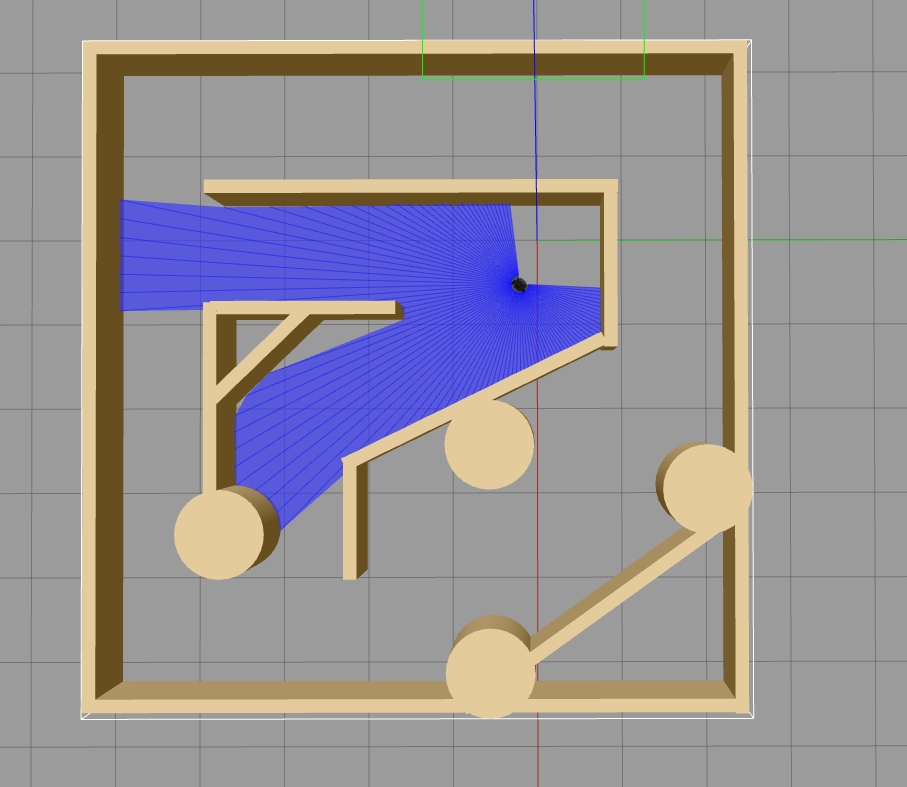

# A Deep Reinforcement Learning Approach for Active SLAM Exploration

This repository hosts the implementation of a deep reinforcement learning approach for active SLAM exploration, inspired by previous research in the field. The work utilizes an archived package called Gym Gazebo, which required significant effort to make it functional again on Ubuntu 18.04 and ROS Melodic.

## Background

The project initially leveraged the Gym Gazebo package, which contained examples like the DQN algorithm. However, due to compatibility issues with the original Kobuki robot's physics, we had to integrate the TurtleBot3 robot package and establish a linkage with Gym Gazebo.

## Proposed Contributions

Our solution introduces novel contributions to the existing framework:

1. **D3QN Algorithm with PER Buffer:**
   We propose the implementation of the D3QN algorithm with a Prioritized Experience Replay (PER) buffer. While this approach was described in previous papers, it was not readily available to the public.

**Environments**
For the enviroments, we modified the 3rd environment (that was originally in the paper) to be as the maze.world env available in GymGazebo. Furthermore, we kept the first two environments for the training phase.
1. Circuit 01

2. Circuit 02

2. Maze(new env)

2. **D2QN Algorithm (Work-in-Progress):**
   Additionally, we aim to implement the D2QN algorithm, although its development is ongoing at the time of this writing.

## Seminar Project 2024

This project serves as our seminar project for the year 2024. As part of our ongoing efforts, we plan to enhance the repository by including informative videos that provide insights into our methodologies, experiments, and results.

Your contributions, feedback, and suggestions are highly appreciated as we continue to refine and expand this work.

For further inquiries or collaborations, please feel free to contact us.

**Team Members:**
- [Said GUERAZEM](https://www.linkedin.com/in/said-guerazem/)

- [Amine Rami BENNACER](https://www.linkedin.com/in/amine-rami-bennacer/)

- [Aghiles BENCHIKH](https://www.linkedin.com/in/aghiles-benchikh/)

**Acknowledgments:**
- We would like to thank the original authors of the [GymGazebo](https://github.com/erlerobot/gym-gazebo) Pkg and the [original paper](https://www.mdpi.com/2076-3417/10/23/8386?type=check_update&version=2) that was the inspiration to engage into this project.

